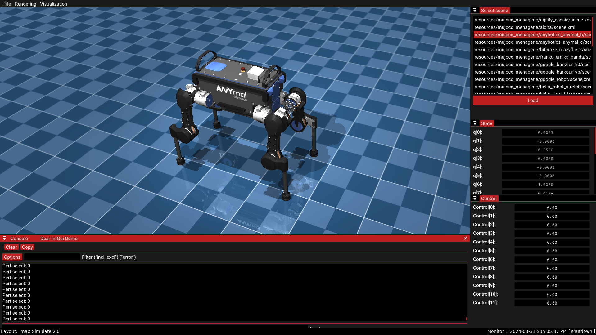

# simulate2
A port of mujoco simulate app, but with better UI (imgui -> docking)

- All the panels are dockable
- When you use INFO, DEBUG, WARN, ERROR macros, the logs also appear in the GUI console
- The overall user experience is expected to be better than the native mujoco simulate.cc example

#### TODO:
- Make perturbations work appropriately